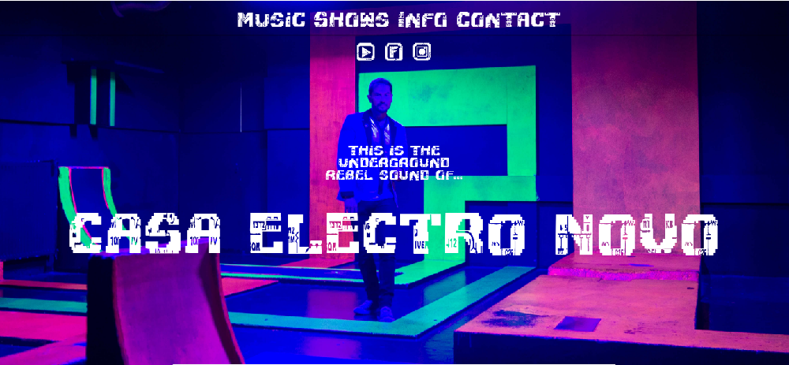
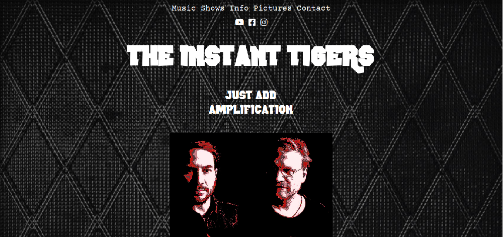

**Developed two sites for musical projects.**

After having success with Carl Smith's [artist page](https://www.ryanoshea.dev/projects/carlsmithart) we agreed to work on two other projects and make two new websites.

- A solo musical project called Casa Electro Novo

  - This project didn't have an existing site

[See the website](https://www.casaelectronovo.rocks)

- A website for a band called The Instant Tigers

  - new site would replace existing site

[See the website](https://www.the-instant-tigers.com)

---

### Tech Stack

- HTML, CSS and Javascript
- Both deployed on Netlify
- JQuery on casaelectronovo.rocks
- Materialize on casaelectronovo.rocks
- [Everylayout](https://every-layout.dev/) on the-instant-tigers.com
- Both use [simplelightbox.com](https://simplelightbox.com/)

---

### Development Notes

As a developer I wanted to get back to basics after using Gatsby, styledcomponents and React for ryanoshea.dev.

For the client this would mean more secure deadlines since few things would go wrong, and give a more certain delivery date.

One thing I did not learn in my course was very weak on website layout, as we were expected to work with designers.

For these websites I choose a single page, single column layout, with a lightbox for the gallery section.

casaelectronovo.rocks was part of a relaunch for the act and needed the incorporation of pictures from a recent photoshoot.

I decided to take one picture and set it as a background and attach a scroll method using JQuery to fade the picture. This was borrowed and adapted from [chvrch.es](https://chvrch.es/)

To ensure delivery time and quality, I also decided to use Materialize for layout, cards and the form. I decided to use Everylayout in the-instant-tigers.com to compare the experience and results with Materialize.
