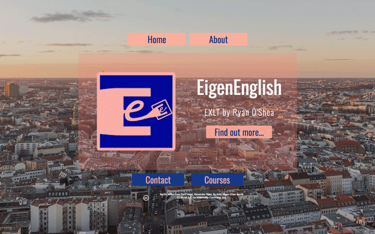

**Used a website builder [Carrd](https://www.carrd.co) to create and launch website for my now defunct freelance teaching business.**

This project started before my formal training as web developer in July 2018.

The [lostintranslation.de](https://www.ryanoshea.dev/projects/lostintranslation) project made me realise that building websites wasn't as painful as I had imagined. In fact, I enjoyed the process and working with a developer.

I needed a website to present myself to the marketplace and relaunch my career as a language teacher.

I had tried out SquareSpace, Wix and Wordpress but the amount of features was making it difficult for me to make design choices. I wanted a simple solution that would get me up and running.

Carrd seemed the right platform to get started on something much more simple. Carrd is a platform that gives users simple one page websites that could be seen as online business cards.

I choose to arrange my site as a story that presented my USP, gave more about me, and presented a clear CTA.

[See the website](https://www.eigenenglish.carrd.co)

The business and the project ran from January until June 2018 and ended when I retrained in web development.
