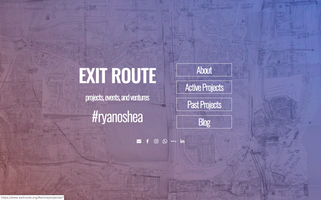

**Used a website builder [Carrd](https://www.carrd.co) to create and launch website for personal projects.**

This project started before my formal training as web developer in July 2018.

The [lostintraslation.de](https://www.ryanoshea.dev/projects/lostintranslation) project made me realise that building websites wasn't as painful as I had imagined. In fact, I enjoyed the process and working with a developer.

I wanted a simple website for my own projects: events and startup ideas. I had tried out SquareSpace, Wix and Wordpress but the amount of features was making it difficult for me to make design choices.

Carrd seemed the right platform to get started on something much more simple. This website was my second site built using card after [eigenenglish.de](https://www.ryanoshea.dev/projects/eigenenglish) and has the same idea of a main page with prominent navigation items:

- About
- Active Projects
- Past Projects
- Blog

[See the website](https://www.exitroute.org)

Past Projects and the Blog are hosted on external services and use subdomains are URLs. This allowed me to produce a more complex website using my limited skills at the time.

I also included analytics but this has since been removed.

A major site upgrade is in the works.
