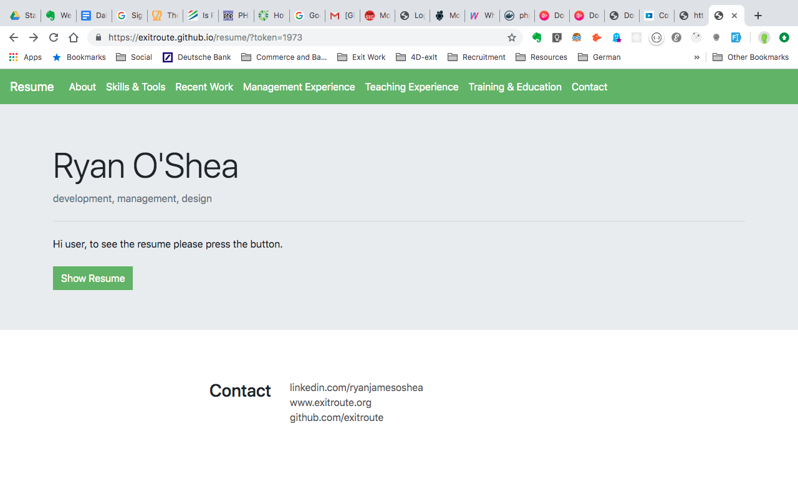

**A web application that generates unique URLs so that job candidates can track who sees their work.** 

[See the code](https://github.com/exitroute/resume)

### Techstack
---
- Bootstrap
- EJS
- Webpack
- Node res

Also using a static site generator by Douglas Matoso:

[Build a static site generator in 40 lines with Node.js](https://www.webdevdrops.com/build-static-site-generator-nodejs-8969ebe34b22/)

### Background
---
It came at an interesting time in my web development learning.

Over Christmas I had become interested in Next.js and Gatsby as tools 
to develop and deploy websites. But the processes behind these tools 
was opaque for me. 

I decided to take the code from the tutorial and use it to deploy 
the resume that I had made in September.

I also wanted to explore separation of concerns and have a separate 
file for the text in a json file.  

This meant I had to go deep into using ejs to create loops for the 
bootstrap components that had repeating elements like the accordian.

One problem I had early was about deciding what should go into the json.

Putting HTML tags didn't feel right. But as I wanted to get it done I 
decided to leave that discussion for another day.

### From Resume Site to Resume App
---
I wanted to make a resume app that users can configure to send optimised 
resumes for job applications in a couple of clicks. So that they could 
use the time for networking rather than writing applications.

The app would have a client, and api and persistent data layer.

In this latest version the data is retrieved from the API when the button 
is clicked via a fetch command, and a bearer token in the header 
which is taken from the url.

More details about the API here:

https://github.com/exitroute/resume-api

The url is generated in the API by the user and then sent as part of the 
application.

Here's the url for demo purposes: 

https://exitroute.github.io/resume/?token=1973 

Landing on the site without this URL does not deliver the data when requested.

A hack would be needed for that :)

### Learned
---
- about server side rendering and templates like ejs, or using javascript and
template literals,
- how decisions made with incomplete knowledge create technical debt
- how to get data from urls using fetch and simple authentication design
- **and** how to configure webpack!!! 

That last point made me smile.

### Status
---
The project is deployed and running as a very early prototype. Enhancements 
are planned.  

